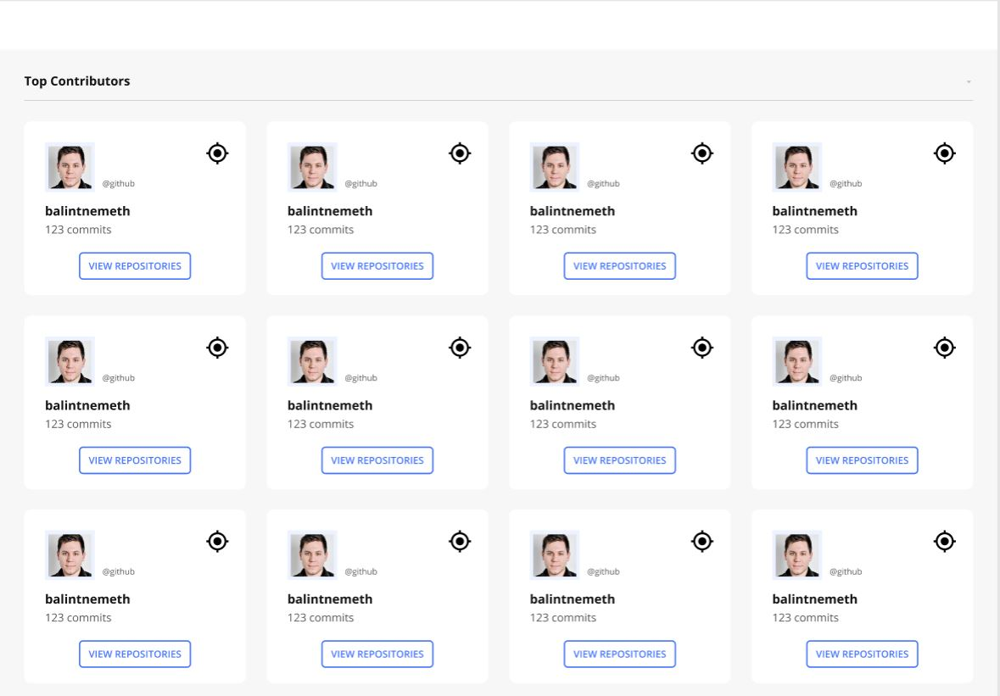

# Egy kis gyakorlás

## Kezdő lépések
- Fogadd el a feladatot a GitHub Classroom-on
- Klónozd le a feladatod repóját a gépedre
- A repository-n belül hozd létre az új Angular-alkalmazást

## Szükséges programok
- [Visual Studio Code](https://code.visualstudio.com/)
- [NodeJS](https://nodejs.org/en/)
- [git-scm](https://git-scm.com/)

## Fő feladat
Készíts egy egyszerű alkalmazást (Angular), amely az Angular GitHub-tárolójának közreműködőit hívja le egy
lapozható listában.

## Működés
1. Felhasználóként szeretném látni a közreműködőket egy rácsos kártyaelrendezésben a commitok száma szerint rendezve.
2. A közreműködők következő oldalát egyszerű lefelé görgetéssel szeretném látni úgy, hogy a további közreműködők akkor jelenjenek meg, 
ha görgetés közben az oldal aljára érek, és még vannak továbbiak.
3. Minden egyes kártyán szeretném látni a profilképet, a felhasználónevet, a commitok számát, egy térkép ikont és 
egy gombot "VIEW REPOSITORIES" felirattal.
5. A kártyán a "VIEW REPOSITORIES" gombra kattintva szeretném egy görgethető listában látni a kiválasztott közreműködő tárolóit a frissítés dátuma szerint rendezve (a legfrissebb van felül).
Minden egyes sorban szeretném látni a repo nevét, azt, hogy forkolt-e vagy sem, azt, hogy 
hány csillaggal rendelkezik, illetve az utolsó frissítés időpontját.

## Előnézeti kép

## Minőség
1. Az alkalmazás jól skálázható, moduláris és karbantartható legyen az architekturális tervezés segítségével.
2. Használd a model -> service -> component felépítést.
3. Gondolj a hibakezelésre a HTTP-kérések esetén: hiba esetén jelenjen meg felugró üzenet. Ezt az alábbi kiegészítők egyikével oldd meg:
 - [ngx-toaster](https://www.npmjs.com/package/ngx-toaster)
 - [ngx-toastr](https://www.npmjs.com/package/ngx-toastr)
4. Ellenőrizd a mobil megjelenést is, az alkalmazás reszponzív legyen.
5. A felületnek követnie kell az előnézetben látható mintát, de alkalmazz egyedi stílusokat, színeket és dizájnelemeket is.

## API-hivatkozások
A következő linkekre küldött kérésekkel tudod lekérni a közreműködők adatait.
- [Közreműködők listája](https://developer.github.com/v3/repos/#list-contributors)
    (példa: https://api.github.com/repos/angular/angular/contributors?per_page=100)
- [Az Angular GitHub-adattár 25 legjelentősebb közreműködőjének lekérdezése](https://api.github.com/repos/angular/angular/contributors?page=1&per_page=25)
- [Felhasználói tárolók listája](https://developer.github.com/v3/repos/#list-user-repositories)
- [Példa egy felhasználó tárolóinak a lekérésére](https://api.github.com/users/cherryApp/repos)

